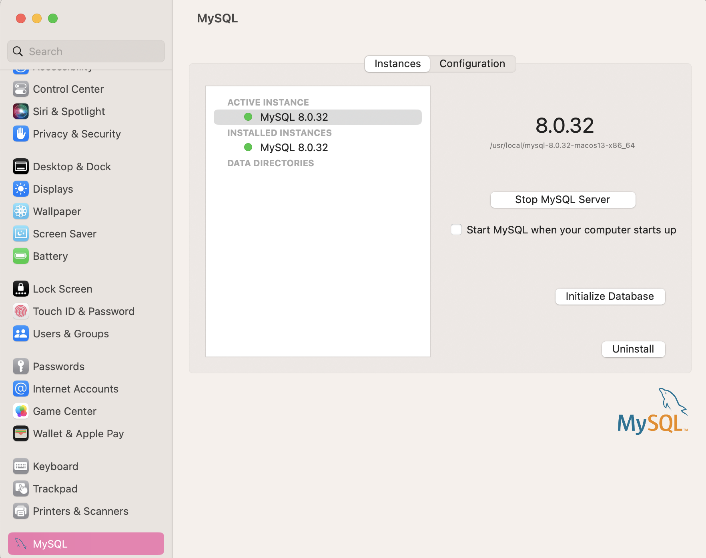
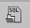

# GoodEnoughReads

## SENG 401 Final Project Winter 2023 (Group 15)

Due to time constraints and technical issues, we were not able to host the website. Instead the demo can be accessed using localhost and the steps below.

### 1. Prerequisites

1. MySQL Community Server version 8.0 or newer installed

    If MySQL is not installed on your machine, visit [this link](https://dev.mysql.com/downloads/mysql/) to download the appropriate version for your operating system. You can check if it is installed by running

    ```terminal
    mysql --version
    ```

    in the terminal. If it is installed, you will see a message similar to `mysql  Ver 8.0.32 for macos13 on x86_64 (MySQL Community Server - GPL)`. When setting up MySQL, follow the instructions of the installer. Set the root password as something easy for you to remember.

    If you are on Mac, you will need to install MySQL Workbench separately. Once MySQL is installed, also install MySQL Workbench from [this link](https://dev.mysql.com/downloads/workbench/), choosing the appropriate version for your operating system.

2. Python version 3.8 or newer

    Check the current version of python by running `python --version` in the terminal. If this number is less than 3.8, upgrading python will be required. Select Python 3.8.16 from [this website](https://www.python.org/downloads/). Follow all instructions to get it installed correctly on your machine.

### 2. Setup

Once the steps above have been completed, setup for the project can begin.

1. Download the source code

    a. Open up a new terminal.

    b. Enter the directory you would like to clone to using the `cd` command.

    c. Run the following comand:

    ```git
    git clone https://github.com/danijourdain/SENG401_Group15_GoodEnoughReads
    ```

2. Set up the environment

    a. Run the following command to allow you to create virtual environments:

    ```python
    pip install virtualenv
    ```

    b. Create the virtual environment by running this command:

    ```python
    python3 -m venv env
    ```

    c. Activate the virtual environment using

    ```terminal
    source env/bin/activate
    ```

    if on Unix/macOS or

    ```command prompt
    .\env\Scripts\activate
    ```

    if on Windows. The terminal should now have (env) at the beginning.

    d. Enter the GoodEnoughReads directory and install all the required Python libraries.

    ```terminal
    cd GoodEnoughReads/
    ```

    ```python
    pip install -r requirements.txt
    ```

3. Set up the database

    a. Ensure MySQL is running. If you are on Windows, and you have killed the MySQL process, visit [this video](https://www.youtube.com/watch?v=TRispu6xgiA) if you need help getting it running again. If on Mac, open settings, scroll to the bottom, click on MySQL and ensure there is a green dot beside MySQL. If the dot is red, click `Start MySQL server`.

    

    b. Open MySQL Workbench and create a new connection. Click the + button next to MySQL Connections on the hompage. Ensure the host is `127.0.0.1`, the port is `3306`, and the username is `root`. Click on the new connection and enter the password for the root user.

    c. Click this button in the top left corner of MySQL Workbench .  Open the folder where this repository was cloned. Select the file `ger_db_init.sql`. Click the lightning bolt icon to run the SQL file and all the queries.

    d. In the terminal window from earlier in the GoodEnoughReads directory, run the following command.

    ```python
    python manage.py migrate
    ```

Congrats! GoodEnoughReads should be ready to run on your local system!

### 3. Running the Project

Now that everything is set up, open the terminal window in the `GoodEnoughReads` directory of the project. Run the following command:

```python
python manage.py runserver
```

If the following is the output, everything is successful!

```command
Watching for file changes with StatReloader
Performing system checks...

System check identified no issues (0 silenced).
March 25, 2023 - 02:09:36
Django version 4.1.6, using settings 'GoodEnoughReads.settings'
Starting development server at http://127.0.0.1:8000/
Quit the server with CONTROL-C.
```

Visit [http://127.0.0.1:8000/](http://127.0.0.1:8000/) to view GoodEnoughReads! Once you are done, type CTRL-C to quit the server. Thank you for using GoodEnoughReads!!

### 4. Running the test cases

#### 4.1 Selenium GUI Tests

Before Running the Selenium tests, please create 2 test users for the database. The first has username Sobia, email sobia.khan1@ucalgary.ca, first name Sobia, last name Khan, and password d. The second user has email tim@gmail.com, first name Tim, last name Smith, username Tim, and password a.

Please ensure that the server is running before running GUI tests.

#### 4.2 Unit Tests

Run unit tests using the command

```python
python manage.py test
```
